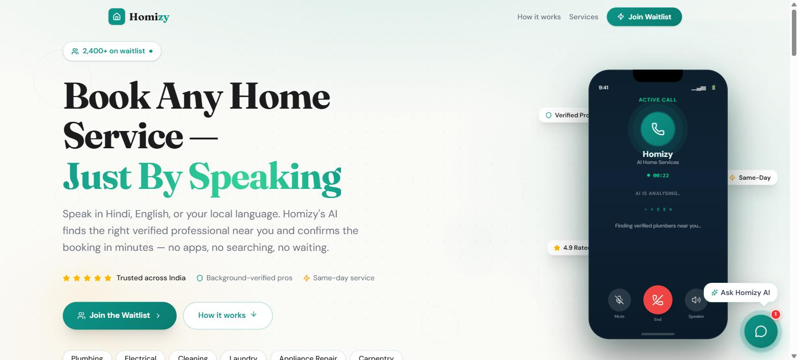
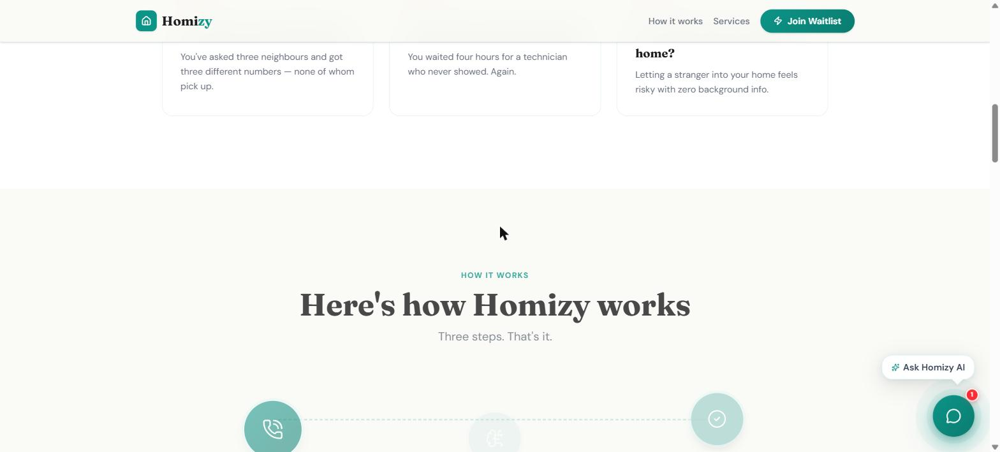
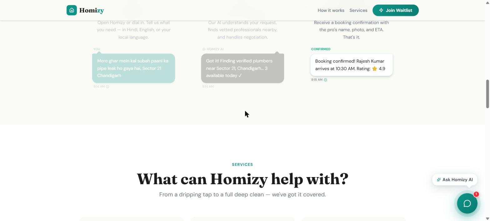
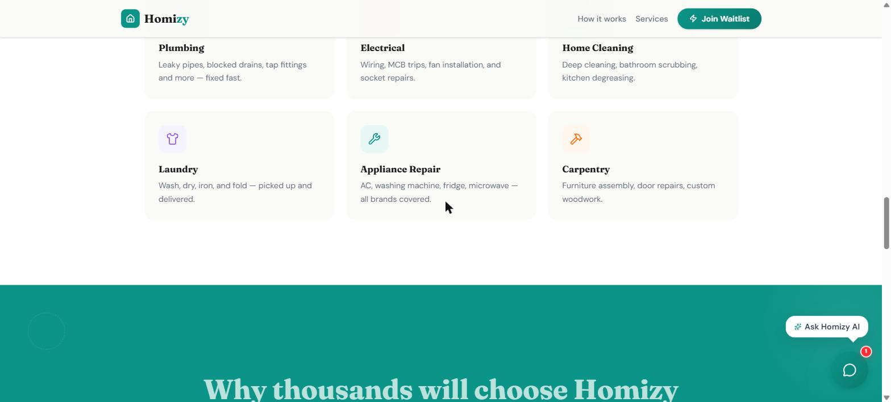
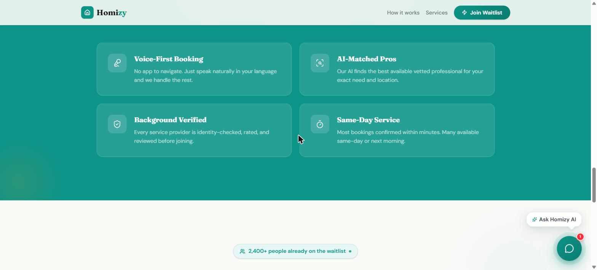
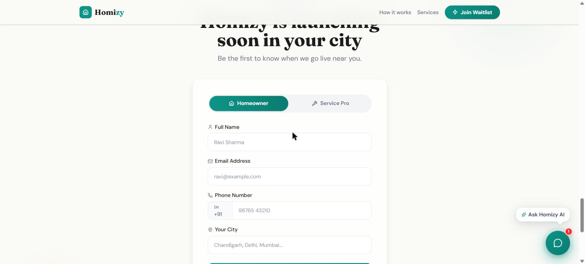

# Homizy — Book Any Home Service, Just By Speaking

> AI-powered home services platform for India. Speak in Hindi, English, or your local language to book verified professionals near you.

[](https://homigo-prelaunch.vercel.app)
[](https://nextjs.org)
[](https://typescriptlang.org)
[](https://vercel.com)

---

## 📸 Screenshots

### Hero Section

*2,400+ people already on the waitlist — Book any home service just by speaking*

### The Problem We Solve

*Can't find a trusted plumber? Wasted your whole morning? Never know who's coming home?*

### How It Works

*Three simple steps: Speak → AI Matches → Booking Confirmed*

### Our Services

*Plumbing, Electrical, Home Cleaning, Laundry, Appliance Repair, Carpentry & more*

### Why Choose Homizy

*Voice-First Booking | AI-Matched Pros | Background Verified | Same-Day Service*

### Join the Waitlist

*Be the first to know when Homizy launches in your city*

---

## 🚀 About Homizy

Homizy is India's first **voice-first AI home services platform**. Instead of searching through apps or calling multiple numbers, you simply speak — in Hindi, English, or your local language — and Homizy's AI finds the right verified professional near you, handles negotiation, and confirms the booking in minutes.

**No apps. No searching. No waiting.**

This repository contains the **pre-launch waitlist landing page**, built to capture early interest and grow the waitlist before the full product launch. With 2,400+ signups already, Homizy is trusted across India.

---

## ✨ Key Features

- 🎙️ **Voice-First Booking** — Speak naturally in any language, no app navigation required
- 🤖 **AI-Matched Pros** — AI finds the best available vetted professional for your exact need and location
- 🛡️ **Background Verified** — Every service provider is identity-checked, rated, and reviewed
- ⚡ **Same-Day Service** — Most bookings confirmed within minutes, many available same-day
- 📝 **Smart Waitlist Form** — Dual registration for Homeowners and Service Pros
- 💾 **Dual Storage** — Local JSON + Google Sheets integration for waitlist data
- 📅 **Automatic Tracking** — Date and time tracking for all waitlist entries
- 💬 **AI Chat Widget** — Interactive "Ask Homizy AI" assistant for visitor engagement
- 🔒 **Rate Limiting** — Prevents duplicate entries and spam submissions
- 📧 **Email Notifications** — Automated confirmation emails via Resend

---

## 🛠️ Services Covered

| Service | Description |
|---|---|
| 🔧 Plumbing | Leaky pipes, blocked drains, tap fittings and more — fixed fast |
| ⚡ Electrical | Wiring, MCB trips, fan installation, socket repairs |
| 🏠 Home Cleaning | Deep cleaning, bathroom scrubbing, kitchen degreasing |
| 👕 Laundry | Wash, dry, iron, and fold — picked up and delivered |
| 🔨 Appliance Repair | AC, washing machine, fridge, microwave — all brands covered |
| 🪚 Carpentry | Furniture assembly, door repairs, custom woodwork |

---

## 🏗️ Tech Stack

| Technology | Purpose |
|---|---|
| **Next.js 15** | React framework with App Router |
| **TypeScript** | Type-safe development |
| **Tailwind CSS** | Utility-first styling |
| **Google Sheets API** | Waitlist data storage and real-time sync |
| **Resend** | Transactional email delivery |
| **Vercel** | Deployment and hosting |

---

## 📁 Project Structure

```
src/
├── app/
│   ├── api/
│   │   ├── chat/          # AI chat endpoint
│   │   └── waitlist/      # Waitlist submission endpoint
│   └── page.tsx           # Main landing page
├── components/
│   ├── sections/          # Page sections (Hero, Services, How It Works, etc.)
│   └── ui/                # Reusable UI components
├── lib/
│   ├── googleSheets.ts    # Google Sheets integration
│   ├── waitlist.ts        # Waitlist logic and rate limiting
│   └── types.ts           # TypeScript types
└── constants/
    └── index.ts           # App constants
```

---

## ⚙️ Getting Started

### 1. Clone and Install

```bash
git clone https://github.com/Munishwar001/Homigo-prelaunch.git
cd Homigo-prelaunch
npm install
```

### 2. Configure Environment Variables

Copy the example env file and fill in your values:

```bash
cp .env.example .env.local
```

| Variable | Description | Required |
|---|---|---|
| `GOOGLE_SHEETS_ID` | Your Google Spreadsheet ID | Optional |
| `GOOGLE_SERVICE_ACCOUNT_CREDENTIALS` | Service account JSON credentials | Optional |
| `RESEND_API_KEY` | Resend API key for email confirmations | Optional |

> **Note:** The waitlist works with local JSON storage by default. Google Sheets and email are optional enhancements.

### 3. Run the Development Server

```bash
npm run dev
```

Open [http://localhost:3000](http://localhost:3000) in your browser.

---

## 💾 Waitlist Data Storage

### Local Storage (Default)
- **Location:** `data/waitlist.json`
- **Format:** JSON array of entries
- **Used as:** Primary / fallback storage

### Google Sheets (Optional)
- Real-time sync when configured
- **Columns:** ID, Name, Email, Phone, City, Role, Date, Time, ISO Timestamp
- **Date format:** DD/MM/YYYY (Indian format)
- **Time format:** HH:MM:SS AM/PM (12-hour format)

See [GOOGLE_SHEETS_SETUP.md](GOOGLE_SHEETS_SETUP.md) for the full setup guide.

---

## 🔒 Security and Anti-Spam

- **Rate limiting** on all API routes
- **Duplicate prevention** — same email or phone cannot register twice
- **Input validation** on all form fields
- **CORS protection** on API routes

See [RATE_LIMITING_AND_ANALYTICS.md](RATE_LIMITING_AND_ANALYTICS.md) for details.

---

## 🚀 Deploy on Vercel

1. Push your code to GitHub
2. Import the repository at [vercel.com](https://vercel.com)
3. Add your environment variables in Vercel project settings
4. Deploy!

> Remember to add your environment variables in Vercel's project settings before deploying.

---

## 🌐 Live Demo

Visit the deployed landing page: **[https://homigo-prelaunch.vercel.app](https://homigo-prelaunch.vercel.app)**

---

## 📄 License

This project is private and proprietary. All rights reserved © 2026 Homizy.

---

*Made with ❤️ in India — Your home, one call away.*
